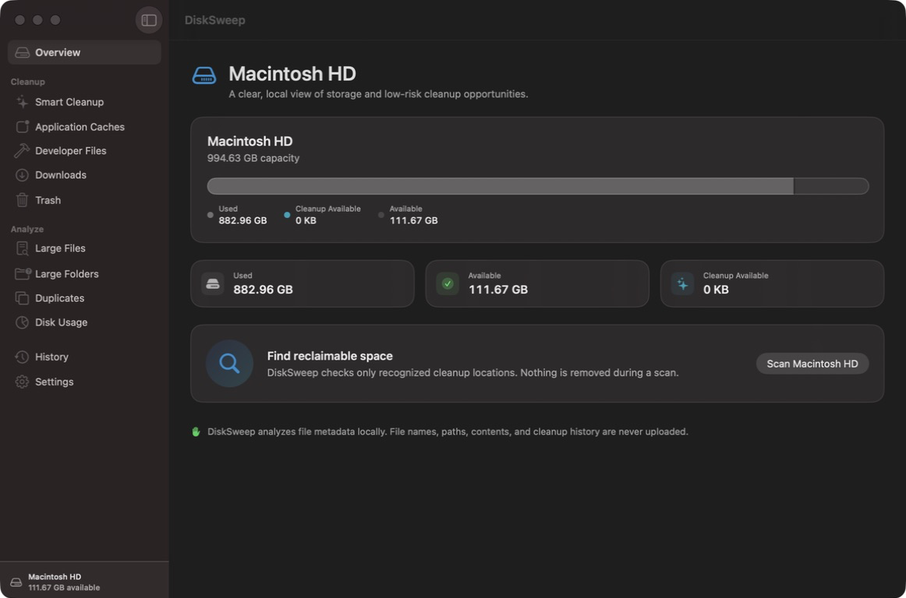

# DiskSweep

DiskSweep is a native SwiftUI utility for understanding disk use and reclaiming space on a Mac without treating deletion as a one-click black box. It is designed around explicit scan locations, visible file-level results, conservative defaults, and a centralized filesystem safety layer.

> [!NOTE]
> The source app is wired end to end and its Debug build and test suite pass. It is still a development build: no signed, notarized distribution is included, and cleanup against real user data was intentionally not performed during repository verification.

## Platform and technology

- macOS 15 or later
- Swift 6
- SwiftUI and Observation
- Foundation, AppKit, CryptoKit, and Quick Look
- Swift Concurrency with cancellable background filesystem work
- No third-party runtime dependencies

## What is implemented

### Filesystem and storage services

- Volume capacity, used-space, and available-space reporting.
- Asynchronous directory enumeration with batched progress updates and cancellation.
- Configurable exclusions for hidden files, packages, cloud placeholders, version-control metadata, dependency folders, photo libraries, backup stores, and user-selected paths.
- Directory sizing that records inaccessible or disappeared files as scan issues instead of failing an entire scan.
- Reusable file-size formatting based on `ByteCountFormatter`.

### Cleanup discovery and analysis

- Cleanup providers for explicit user-scoped roots: user and application caches, logs, current-user temporary files, Trash, browser caches, Downloads, Xcode DerivedData and archives, simulator caches, Xcode Device Support, Swift Package Manager caches, and Homebrew downloads.
- Log cleanup is limited to individual files that have remained unchanged for at least 30 days; active logs and whole log directories are never offered, and old logs still require review.
- Large-file discovery with configurable thresholds.
- Hierarchical large-folder and disk-usage analysis rooted at the user's home directory.
- Downloads grouping for disk images, archives, installers, videos, images, documents, and other files, with age and size filters. Downloads are never preselected.
- Staged duplicate detection: size grouping, partial sampling, SHA-256 hashing, and final byte-for-byte confirmation. Hard-link aliases are excluded and selection helpers preserve at least one copy.
- Risk classification for regeneratable data, items needing review, and user-created files.

### Cleanup and local state

- A centralized cleanup engine that accepts provider-specific authorizations and uses `FileManager` for Trash or permanent removal.
- A final identity and boundary revalidation immediately before each filesystem mutation.
- Cleanup results and history distinguish bytes moved to Trash from capacity actually recovered; same-volume Trash moves are never credited as free space.
- Local settings stored in `UserDefaults`, including general behavior, scan locations, exclusions, developer categories, and privacy preferences.
- Bounded cleanup history stored as atomically written JSON at:

  ```text
  ~/Library/Application Support/DiskSweep/cleanup-history.json
  ```

- Native Finder reveal and Quick Look support.
- A conservative Full Disk Access status explanation and a native link to the corresponding System Settings pane.

### Interface components

The native SwiftUI application coordinator connects sidebar navigation, real scan progress, cancellation, incremental results, cleanup selection, review, execution, completion, history, settings, Finder reveal, and Quick Look. Dedicated screens cover storage overview, Smart Cleanup, application and developer caches, Downloads, Trash, large files, large folders, duplicates, disk usage, cleanup history, and settings.

The interface uses standard macOS navigation, materials, menus, shortcuts, light/dark appearance, selection controls, and accessibility labels. A cancelled cleanup scan retains completed categories and labels them as partial results rather than presenting them as a complete scan.

## Screenshots



This is the running Debug build using real local volume statistics before a cleanup scan. The application was also exercised through live scan progress and cancellation, populated results, cleanup review, analyzer navigation, Settings, Finder/Quick Look affordances, and history/empty states. No real cleanup action was executed during visual verification.

Icon source artwork and generated app-icon assets are already available under `Artwork/` and `DiskSweep/Assets.xcassets/AppIcon.appiconset/`.

## Safety philosophy

> DiskSweep uses an allowlist-based cleanup engine. It only deletes files from locations explicitly recognized as safe cleanup targets.

A scan never deletes anything. Cleanup candidates retain their provider identity, cleanup category, risk, and path; each provider separately supplies its approved roots. Before a mutation, the safety layer:

1. Requires a local file URL and rejects path-traversal components.
2. Canonicalizes the provider's approved roots and requires a user-scoped location.
3. Refuses the approved root itself, direct symbolic-link targets, cross-volume targets, and anything outside the authorized root.
4. Blocks protected system and user locations, including system directories, Documents, Desktop, media libraries, credentials, mail, messages, browser data, cloud storage, backups, and non-cache Application Support data.
5. Records exact scan-time device, inode, size, allocation, modification-time, change-time, and file-kind identity for every provider cleanup candidate—including Downloads analyzer results.
6. Revalidates that identity, active exclusions, directory descendants, and volume boundaries immediately before mutation to reduce time-of-check/time-of-use risk.
7. Uses native `FileManager` operations—never path-interpolated shell deletion commands.

Arbitrary user files, including Downloads and duplicate copies, are not selected automatically. The cleanup engine defaults user files to the system Trash. Emptying Trash and an explicitly requested permanent deletion remain irreversible operations and must be presented accordingly by the UI.

## Privacy

DiskSweep's analysis is local to the Mac. The current code contains no analytics client, account system, cloud sync, or upload path for file names, paths, contents, scan results, or cleanup history.

Duplicate analysis necessarily reads file samples and, for plausible matches, full file contents to compute a local SHA-256 digest and confirm byte equality. Those bytes and hashes are used only during local analysis. Settings remain in `UserDefaults`; cleanup history remains in the local Application Support file described above.

## Permissions and Full Disk Access

DiskSweep operates as the signed-in user. It does not require root, install a privileged daemon, bypass System Integrity Protection, or ask users to disable macOS security controls.

Full Disk Access is optional. Granting it can make more protected user-library locations readable, but it does not expand DiskSweep's cleanup allowlist or weaken the safety validator. When access is unavailable, scanners are expected to skip inaccessible paths and report the limitation.

macOS does not expose a public API that conclusively reports Full Disk Access status. `PermissionManager` therefore presents a clearly qualified local estimate and can open Full Disk Access in System Settings through `NSWorkspace`; it never changes the permission itself.

The project currently has App Sandbox disabled because broad, user-requested disk analysis is central to the utility. Hardened Runtime remains enabled. Any distributed build should be code signed, reviewed, and notarized before release.

## Architecture

DiskSweep uses a layered, dependency-injectable design:

```text
DiskSweep/
├── App/                     Application entry point
├── Models/                  Codable, hashable, and sendable domain models
├── ViewModels/              Main-actor app orchestration and UI state
├── Services/
│   ├── Analyzers/           Large-file, folder, Downloads, and duplicate analysis
│   ├── Providers/           Allowlisted cleanup-location discovery
│   ├── FileSystemScanner    Batched, cancellable enumeration
│   ├── SafetyValidator      Path, identity, symlink, and boundary validation
│   ├── CleanupSnapshotRegistry  Scan-time identity handoff
│   ├── CleanupEngine        Revalidated Trash/permanent mutations
│   ├── SettingsStore        Observation plus UserDefaults persistence
│   └── CleanupHistoryStore  Atomic local JSON history
└── Views/                   Data-driven SwiftUI screens and components

DiskSweepTests/              Focused unit tests using temporary directories
project.yml                  XcodeGen source of truth
DiskSweep.xcodeproj/         Generated project for direct Xcode use
```

Filesystem-intensive work is isolated from the main actor. UI-facing stores use Observation on the main actor, while scanner, analyzer, and cleanup services expose async APIs and sendable values.

## Development setup

### Requirements

- A Mac running macOS 15 or later
- Xcode with Swift 6 and the macOS 15 SDK or later
- XcodeGen only when regenerating the project

### Open and run in Xcode

The generated Xcode project is included, so XcodeGen is not required for normal use:

1. Open `DiskSweep.xcodeproj`.
2. Select the `DiskSweep` scheme and the local Mac destination.
3. Build with **Product > Build** or press `Command-B`.
4. Run with **Product > Run** or press `Command-R`.

### Command-line build and tests

```bash
xcodebuild \
  -project DiskSweep.xcodeproj \
  -scheme DiskSweep \
  -destination 'platform=macOS' \
  build
```

```bash
xcodebuild \
  -project DiskSweep.xcodeproj \
  -scheme DiskSweep \
  -destination 'platform=macOS' \
  test
```

The unit-test sources cover allowlist containment and root shapes, traversal and symlink rejection, protected paths, exact scan-time identity replacement, nested exclusions, permitted and refused cleanup mutations, scanner exclusions and cancellation, directory sizing, large-file and large-folder analysis, disk-usage trees, Downloads classification/filtering and safe bridge behavior, duplicate confirmation and selection safety, settings persistence, and cleanup-history persistence. Tests use temporary directories and should not point cleanup code at real user data.

### Verification performed

On August 17, 2026, the generated project was built with the macOS 15 deployment target using Swift 6 and the current Xcode toolchain. The full Xcode test run completed **61 tests with 0 failures**. The Debug application was then launched and visually inspected in dark appearance; navigation, settings, live scan progress, cancellation, partial results, and the final cleanup-review sheet were exercised without approving a filesystem mutation.

### Regenerate the Xcode project

`project.yml` is the declarative project source. If files or target settings change, install XcodeGen and regenerate from the repository root:

```bash
brew install xcodegen
xcodegen generate
```

Review the generated project diff before committing it. For ordinary building, testing, and editing, use the included `DiskSweep.xcodeproj` directly.

## Current limitations

- Provider discovery is intentionally conservative. Unrecognized application or browser layouts are skipped, and simulator cleanup is limited to cache directories rather than simulator app data.
- Full Disk Access detection is necessarily heuristic, and macOS permissions may still hide individual locations.
- Large-scale performance on Macs containing millions of files has not yet been characterized.
- Running-app visual QA covered the current host in dark appearance; a full light-mode, VoiceOver, keyboard-only, and automated visual-regression matrix remains future release work.
- The macOS 15 deployment target compiles, but this verification run used the current host and SDK rather than a separate macOS 15 machine or virtual machine.
- Cleanup mutations were verified only against isolated temporary test directories. The running app's real-user-data cleanup button was deliberately not activated during QA.
- The engine revalidates immediately before each native `FileManager` path mutation, but path-based APIs still leave a narrow adversarial swap window. A higher-assurance release should use descriptor-relative filesystem operations or an atomic same-volume quarantine design.
- No signed, notarized, distributable release artifact is included.

Treat this repository as a complete source implementation and a development build, not as a finished consumer release package. Review, sign, notarize, and repeat destructive-path validation before distribution.
